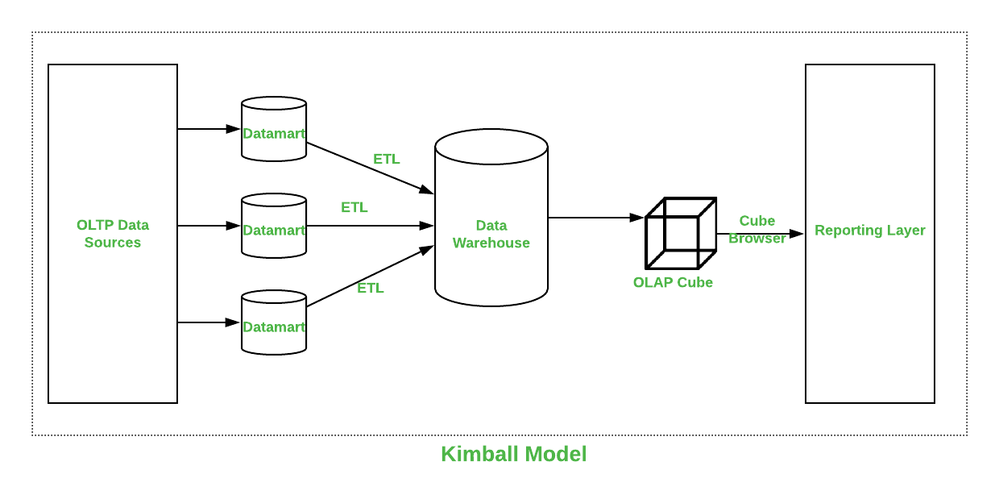
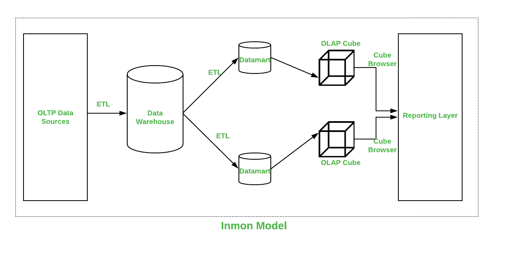

# Модуль А

**DWH** **—** это централизованное хранилище данных, предназначенное для аналитики и объединения информации из разных источников.

[DWH **(Data** **Warehouse)** **представляет** **собой** **систему,** **где** **собираются** **большие** **объемы** **исторических** **данных** **из** **различных** **источников:** **CRM,** **ERP,** **веб-сайтов,** **мобильных** **приложений,** **маркетинговых** **сервисов** **и** **даже** **Excel-файлов.** **В** **отличие** **от** **обычных** **баз** **данных,** **которые** **оптимизированы** **для** **оперативной** **работы** **приложений,** **DWH** **предназначено** **для** **анализа,** **построения** **отчетов** **и** **прогнозирования,** **предоставляя** **единый **источник** **правды**** **для** **бизнеса.**](https://www.bing.com/ck/a?!&&p=1bf1a374936d4a9807b9cbff7b5e8091587cfb360e477af0ba601a543e7026f1JmltdHM9MTc3Njk4ODgwMA&ptn=3&ver=2&hsh=4&fclid=02ba2cb7-82cb-651e-285f-3af1839c642d&psq=%d1%87%d1%82%d0%be+%d1%82%d0%b0%d0%ba%d0%be%d0%b5+dwh&u=a1aHR0cHM6Ly9oYWJyLmNvbS9ydS9jb21wYW5pZXMvb3R1cy9hcnRpY2xlcy85NTAzMjgv&ntb=1)

## Основные **функции** **DWH**

* [ **Централизация **данных**** **:** **объединяет** **информацию** **из** **разрозненных** **систем,** **устраняя** **дублирование** **и** **разнородность.** ](https://www.bing.com/ck/a?!&&p=6dd48ca7afbe39166faa6515c3f806dab072ebbe576cede386290b14f75af120JmltdHM9MTc3Njk4ODgwMA&ptn=3&ver=2&hsh=4&fclid=02ba2cb7-82cb-651e-285f-3af1839c642d&psq=%d1%87%d1%82%d0%be+%d1%82%d0%b0%d0%ba%d0%be%d0%b5+dwh&u=a1aHR0cHM6Ly9jaW8tbmF2aWdhdG9yLnJ1L2RhdGEtd2FyZWhvdXNlLw&ntb=1)[**1**](https://www.bing.com/ck/a?!&&p=6dd48ca7afbe39166faa6515c3f806dab072ebbe576cede386290b14f75af120JmltdHM9MTc3Njk4ODgwMA&ptn=3&ver=2&hsh=4&fclid=02ba2cb7-82cb-651e-285f-3af1839c642d&psq=%d1%87%d1%82%d0%be+%d1%82%d0%b0%d0%ba%d0%be%d0%b5+dwh&u=a1aHR0cHM6Ly9jaW8tbmF2aWdhdG9yLnJ1L2RhdGEtd2FyZWhvdXNlLw&ntb=1)
* [ **Очистка **и** **стандартизация**** **:** **данные** **приводятся** **к** **единому** **формату,** **проверяются** **и** **структурируются** **для** **удобного** **анализа.** ](https://www.bing.com/ck/a?!&&p=6916a47b3213666311a092681c57571c9a5c5e26051861910d6d03032c74e470JmltdHM9MTc3Njk4ODgwMA&ptn=3&ver=2&hsh=4&fclid=02ba2cb7-82cb-651e-285f-3af1839c642d&psq=%d1%87%d1%82%d0%be+%d1%82%d0%b0%d0%ba%d0%be%d0%b5+dwh&u=a1aHR0cHM6Ly93d3cuMWNiaXQucnUvYmxvZy9jaHRvLXRha29lLWR3aC1pLXphY2hlbS1vbm8tYml6bmVzdS8&ntb=1)[**2**](https://www.bing.com/ck/a?!&&p=6916a47b3213666311a092681c57571c9a5c5e26051861910d6d03032c74e470JmltdHM9MTc3Njk4ODgwMA&ptn=3&ver=2&hsh=4&fclid=02ba2cb7-82cb-651e-285f-3af1839c642d&psq=%d1%87%d1%82%d0%be+%d1%82%d0%b0%d0%ba%d0%be%d0%b5+dwh&u=a1aHR0cHM6Ly93d3cuMWNiaXQucnUvYmxvZy9jaHRvLXRha29lLWR3aC1pLXphY2hlbS1vbm8tYml6bmVzdS8&ntb=1)
* [ **Поддержка **аналитики**** **:** **обеспечивает** **быстрый** **доступ** **к** **историческим** **данным** **для** **построения** **отчетов,** **дашбордов** **и** **BI-аналитики.** ](https://www.bing.com/ck/a?!&&p=4b23e3a39e6e43b7938b06cbc026e5cbb5282bafc27c0339df7f98305c26bda1JmltdHM9MTc3Njk4ODgwMA&ptn=3&ver=2&hsh=4&fclid=02ba2cb7-82cb-651e-285f-3af1839c642d&psq=%d1%87%d1%82%d0%be+%d1%82%d0%b0%d0%ba%d0%be%d0%b5+dwh&u=a1aHR0cHM6Ly9wcmFjdGljdW0ueWFuZGV4LnJ1L2Jsb2cvY2h0by10YWtvZS1ocmFuaWxpc2hlLWRhbm55aC1kYXRhLXdhcmVob3VzZS8&ntb=1)[**2**](https://www.bing.com/ck/a?!&&p=4b23e3a39e6e43b7938b06cbc026e5cbb5282bafc27c0339df7f98305c26bda1JmltdHM9MTc3Njk4ODgwMA&ptn=3&ver=2&hsh=4&fclid=02ba2cb7-82cb-651e-285f-3af1839c642d&psq=%d1%87%d1%82%d0%be+%d1%82%d0%b0%d0%ba%d0%be%d0%b5+dwh&u=a1aHR0cHM6Ly9wcmFjdGljdW0ueWFuZGV4LnJ1L2Jsb2cvY2h0by10YWtvZS1ocmFuaWxpc2hlLWRhbm55aC1kYXRhLXdhcmVob3VzZS8&ntb=1)
* [ **Хранение **исторических** **данных**** **:** **позволяет** **отслеживать** **изменения** **показателей** **и** **поведение** **клиентов** **или** **процессов** **во** **времени.** ](https://www.bing.com/ck/a?!&&p=18d10a1671f0151cc25a832408a414828301844c7deb84b20310d7fefcc5cc55JmltdHM9MTc3Njk4ODgwMA&ptn=3&ver=2&hsh=4&fclid=02ba2cb7-82cb-651e-285f-3af1839c642d&psq=%d1%87%d1%82%d0%be+%d1%82%d0%b0%d0%ba%d0%be%d0%b5+dwh&u=a1aHR0cHM6Ly92Yy5ydS9haS8yMzAxNTIxLWNodG8tdGFrb2UtZHdoLWktZWdvLXJvbC12LWFuYWxpdGlrZS1iaXpuZXNh&ntb=1)

## Архитектура **DWH**

1. [**Staging **(промежуточный** **слой)**** **—** **загрузка** **данных** **из** **источников** **в** **исходном** **виде,** **первичная** **проверка** **и** **очистка.** ](https://www.bing.com/ck/a?!&&p=1bf1a374936d4a9807b9cbff7b5e8091587cfb360e477af0ba601a543e7026f1JmltdHM9MTc3Njk4ODgwMA&ptn=3&ver=2&hsh=4&fclid=02ba2cb7-82cb-651e-285f-3af1839c642d&psq=%d1%87%d1%82%d0%be+%d1%82%d0%b0%d0%ba%d0%be%d0%b5+dwh&u=a1aHR0cHM6Ly9oYWJyLmNvbS9ydS9jb21wYW5pZXMvb3R1cy9hcnRpY2xlcy85NTAzMjgv&ntb=1)[**2**](https://www.bing.com/ck/a?!&&p=1bf1a374936d4a9807b9cbff7b5e8091587cfb360e477af0ba601a543e7026f1JmltdHM9MTc3Njk4ODgwMA&ptn=3&ver=2&hsh=4&fclid=02ba2cb7-82cb-651e-285f-3af1839c642d&psq=%d1%87%d1%82%d0%be+%d1%82%d0%b0%d0%ba%d0%be%d0%b5+dwh&u=a1aHR0cHM6Ly9oYWJyLmNvbS9ydS9jb21wYW5pZXMvb3R1cy9hcnRpY2xlcy85NTAzMjgv&ntb=1)
2. [**Data **Warehouse** **(ядро)**** **—** **централизованное** **хранилище,** **где** **данные** **структурируются,** **обогащаются** **и** **объединяются,** **с** **использованием** **метаданных** **для** **управляемости.** ](https://www.bing.com/ck/a?!&&p=6dd48ca7afbe39166faa6515c3f806dab072ebbe576cede386290b14f75af120JmltdHM9MTc3Njk4ODgwMA&ptn=3&ver=2&hsh=4&fclid=02ba2cb7-82cb-651e-285f-3af1839c642d&psq=%d1%87%d1%82%d0%be+%d1%82%d0%b0%d0%ba%d0%be%d0%b5+dwh&u=a1aHR0cHM6Ly9jaW8tbmF2aWdhdG9yLnJ1L2RhdGEtd2FyZWhvdXNlLw&ntb=1)[**1**](https://www.bing.com/ck/a?!&&p=6dd48ca7afbe39166faa6515c3f806dab072ebbe576cede386290b14f75af120JmltdHM9MTc3Njk4ODgwMA&ptn=3&ver=2&hsh=4&fclid=02ba2cb7-82cb-651e-285f-3af1839c642d&psq=%d1%87%d1%82%d0%be+%d1%82%d0%b0%d0%ba%d0%be%d0%b5+dwh&u=a1aHR0cHM6Ly9jaW8tbmF2aWdhdG9yLnJ1L2RhdGEtd2FyZWhvdXNlLw&ntb=1)
3. [**Data **Marts** **(витрины** **данных)**** **—** **специализированные** **представления** **для** **отдельных** **бизнес-направлений,** **упрощающие** **доступ** **к** **аналитической** **информации.** ](https://www.bing.com/ck/a?!&&p=1bf1a374936d4a9807b9cbff7b5e8091587cfb360e477af0ba601a543e7026f1JmltdHM9MTc3Njk4ODgwMA&ptn=3&ver=2&hsh=4&fclid=02ba2cb7-82cb-651e-285f-3af1839c642d&psq=%d1%87%d1%82%d0%be+%d1%82%d0%b0%d0%ba%d0%be%d0%b5+dwh&u=a1aHR0cHM6Ly9oYWJyLmNvbS9ydS9jb21wYW5pZXMvb3R1cy9hcnRpY2xlcy85NTAzMjgv&ntb=1)

## Зачем **нужен** **DWH** **бизнесу**

[DWH **позволяет** **компаниям** **видеть**  **целостную **картину** **бизнеса**** **,** **объединяя** **данные** **о** **продажах,** **маркетинге,** **финансах** **и** **производстве.** **Это** **особенно** **важно,** **когда** **информации** **становится** **слишком** **много,** **и** **ручной** **сбор** **данных** **из** **разных** **систем** **становится** **неэффективным.** **С** **помощью** **DWH** **аналитики** **и** **менеджеры** **могут** **быстро** **получать** **ответы** **на** **ключевые** **вопросы,** **строить** **прогнозы** **и** **принимать** **обоснованные** **решения.** ](https://www.bing.com/ck/a?!&&p=4b23e3a39e6e43b7938b06cbc026e5cbb5282bafc27c0339df7f98305c26bda1JmltdHM9MTc3Njk4ODgwMA&ptn=3&ver=2&hsh=4&fclid=02ba2cb7-82cb-651e-285f-3af1839c642d&psq=%d1%87%d1%82%d0%be+%d1%82%d0%b0%d0%ba%d0%be%d0%b5+dwh&u=a1aHR0cHM6Ly9wcmFjdGljdW0ueWFuZGV4LnJ1L2Jsb2cvY2h0by10YWtvZS1ocmFuaWxpc2hlLWRhbm55aC1kYXRhLXdhcmVob3VzZS8&ntb=1)

Таким **образом,** **DWH** **—** **это** **не** **просто** **база** **данных,** **а**  **инструмент **стратегической** **аналитики**** **,** **который** **помогает** **бизнесу** **управлять** **данными,** **видеть** **исторические** **тенденции** **и** **принимать** **решения** **на** **основе** **единой,** **структурированной** **информации.**

Проектирование хранилища данных - важная часть развития бизнеса. Для проектирования есть две наиболее распространенные архитектуры - **Kimball** и **Inmon,** но вопрос в том, какая из них лучше, какая обслуживает пользователей с низким уровнем избыточности. Давайте сравним оба по некоторым факторам.

**1. Кимбалл:**
Подход Кимбалла к проектированию Dataware House был представлен **Ральфом Кимбаллом** . Этот подход начинается с распознавания бизнес-процессов и вопросов, на которые компания Dataware должна ответить. Эти наборы информации анализируются, а затем хорошо документируются. Программное обеспечение Extract Transform Load (ETL) переносит все данные из нескольких источников данных, называемых витринами данных, а затем загружает их в общую область, называемую промежуточной. Затем он преобразуется в куб OLAP.

**2. Инмон:**
Подход Inmon к проектированию Dataware House был представлен **Биллом Инмоном** . Этот подход начинается с корпоративной модели данных. Эта модель распознает ключевые области, а также заботится о клиентах, продуктах и поставщиках. Эта модель служит для создания подробной логической модели, которая используется для основных операций. Детали, модель затем используется для разработки физической модели. Эта модель нормализована и снижает избыточность данных. Это сложная модель, которую трудно использовать в бизнес-целях, для которых создаются витрины данных, и каждый отдел может использовать ее в своих целях.

**Приложения :**

* Хранилище данных очень гибко к изменениям.
* Бизнес-процесс можно понять очень легко.
* Отчеты можно обрабатывать по всему предприятию.
* Процесс ETL менее подвержен ошибкам.

Архитектура дома Inmon Dataware показана ниже:

| col1 | col2 | col3 |
| ---- | ---- | ---- |
|      |      |      |
|      |      |      |
